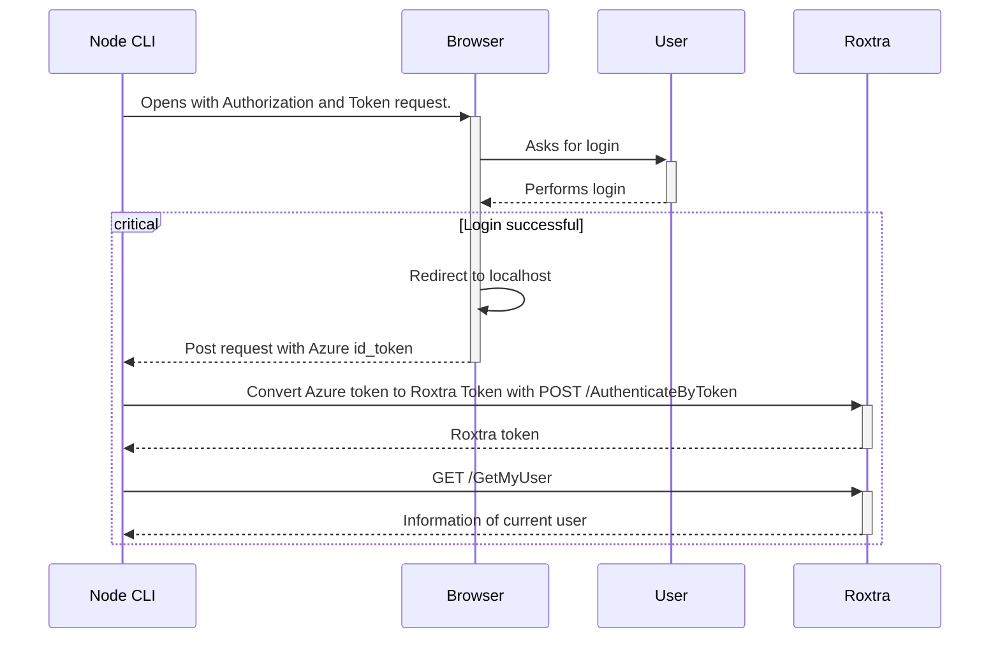

# Azure and roXtra authentication flow

This example performs multiple requests to show the authentication flow of Azure and Roxtra.  
The following steps are taken to fetch the user information from a protected roXtra endpoint:

1. Perform the azure login and token request in an external browser window.
2. A successful login redirects to `localhost:3000`. The node server receives a post request containing the authentication token.
3. The Azure authentication token is converted to a roXtra authtoken by requesting `/AuthenticateByToken`.
4. The roXtra authtoken is used to access the proteced endpoint `/GetMyUser` and the user is printed to console.





## Installing node

This example uses a small `node.js` server to handle the authentication.  
If you dont have a node installation ready you can download it [here](https://nodejs.org/en/download). It will also install `npm` which you will need later.  
Follow the installer instructions and continue with the example.


## Project Prerequisites

Run the following command in the project directory to install all dependencies.

```shell
npm install
```

For the authentication to be granted, `http://localhost` has to be set as `redirect url` in your Azure configuration.


## Setting up the example

To get started with the example, the `authConfig` of [AuthenticationFlow](./AuthenticationFlow.js) has to be changed.
* `authURL`: Azure authentication provider
* `tenant`: Azure tenant ID
* `clientId`: Azure client ID registered with roXtra
* `roxtraURL`: Roxtra URL 

```js
const authConfig = {
    authURL: "https://login.microsoftonline.com",
    tenant: "<your tenant id>",
    clientId: "<your client id>",
    roxtraURL: "<your roxtra url>"
}
```


## Running the example

Run the following command in the project direectory to start the authentication flow.

```shell
npm start
```

After starting successfully, a browser window should open with a login request and the previously mentioned steps will be performed.  
The console will inform you about the current process and will exit after the user information has been fetched successfully.


## Additional Information

If you have issues or want additional information, you can visit the [Microsoft Learn OAuth2 documentation](https://learn.microsoft.com/en-us/entra/identity-platform/v2-oauth2-auth-code-flow#request-an-id-token-as-well-or-hybrid-flow).